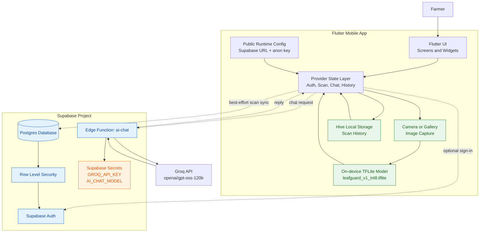
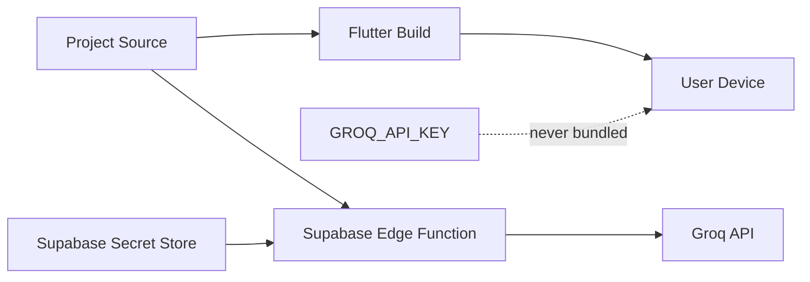

# LeafGuard System Design

## Architecture Overview

## Main Runtime Flows

### Offline scan

1. The farmer captures a photo or selects one from the gallery.
2. `TFLiteService` resizes the image and runs the bundled model locally.
3. The prediction and confidence are shown immediately by the Flutter UI.
4. `LocalStorageService` saves the result in Hive, even without internet.
5. If Supabase is configured and the user is signed in, `SupabaseService` attempts a best-effort cloud sync.

### AI assistant

1. The Flutter app sends the message, recent chat history, language, and optional scan context to the `ai-chat` Edge Function.
2. The Edge Function reads `GROQ_API_KEY` and `AI_CHAT_MODEL` from Supabase environment secrets.
3. The function sends the request to Groq's OpenAI-compatible API.
4. Groq's response returns through the Edge Function to the Flutter app.
5. The Groq key is never included in the Flutter application or returned to the client.

### Authentication and data protection

- Supabase Auth manages signed-in users.
- `profiles`, `scans`, and `chat_messages` are stored in Postgres.
- Row Level Security limits records to the owning authenticated user.
- Local Hive storage remains the primary source for the app's scan history.
- The AI function can be deployed with JWT verification disabled for the demo's guest flow, or used with anonymous/authenticated Supabase sessions.

## Deployment Boundary

The Supabase anon key and project URL are public client configuration. The Groq API key is a server secret and must only be configured with Supabase secrets or a local server-side env file for development.
